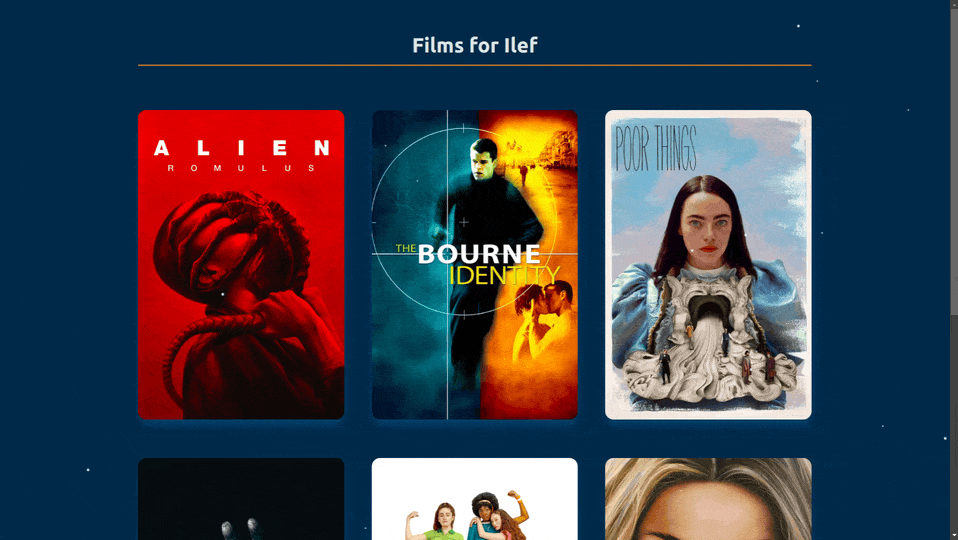

# Films for you

A small "one-off" holiday project that is a small list of film recommendations for my dear friend, Ilef.

---

Though relatively small, I used this project to learn an apply a few new tools including:

- Building APIs with [FastAPI](https://fastapi.tiangolo.com/) (and comparing that to [Flask](https://flask.palletsprojects.com/en/stable/), from which I came)
- Loding skeleton libraries in React ecosystem
- Particle libraries in the React ecosystem
- Hosting a one-page site (on [Render](https://render.com/), at the time of writing)

---

## A note on loading times

If the films load really slowly at first (I'm talking like 15 seconds slooooow), it's not your fault.
\
That's just a side effect of where the project is hosted.
\
\
This project is currently hosted on Render's free tier, which--effectively--puts
\
the project's resources to sleep occasionally.
\
\
Subsequent loading of the page after the first slow load will be quick.
